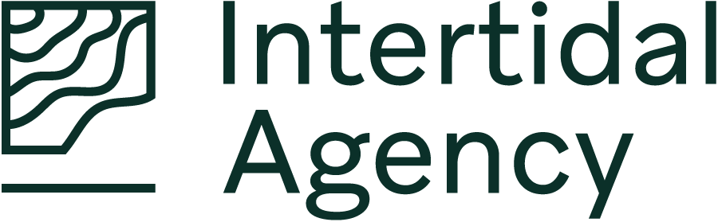

# Intertidal Agency
### Unlocking ocean data for global good
<!--  
  
-->  
Intertidal Agency is a nonprofit that works with governments, tribes, scientists, nonprofits, and industry to unlock data for ocean sustainability. As connectors and facilitators, we translate across ocean research, policy, and data science, sharing what we learn and creating open, reusable frameworks for future challenges. Our partnerships are designed to build the capacity of all people who interact with ocean data so they can navigate the complexities and opportunities of data sharing.  We help our partners expand their technical data sharing skills, create a culture of data sharing, and grow the global community of ocean data stewards.  
  
[Discover more about us!](https://intertidal.agency/)  

